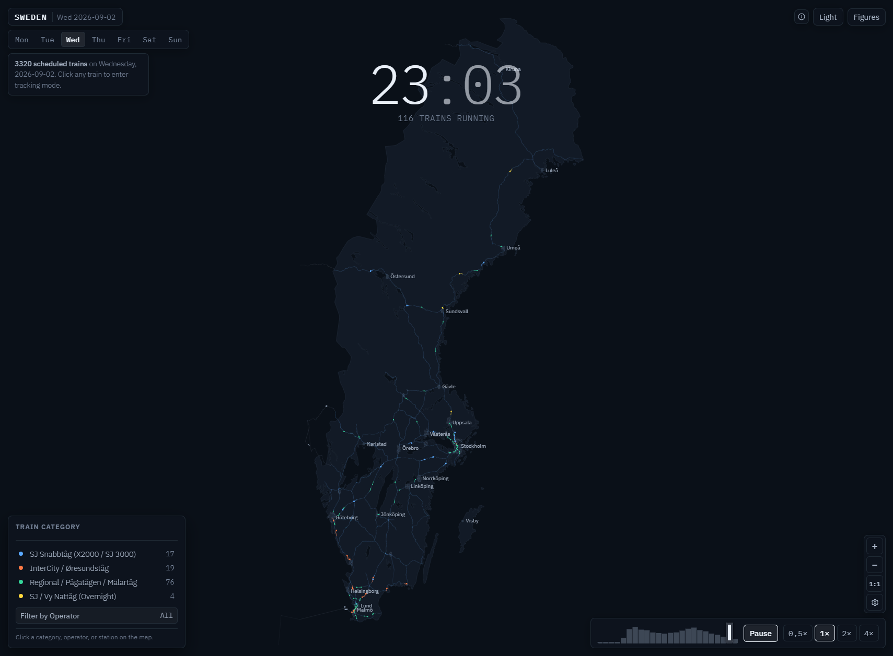

# All Trains in a Day: Sweden

An interactive 24-hour visualization of passenger train movements across Sweden. Built with vanilla HTML5 Canvas and JavaScript without external runtime dependencies.

<p align="center">
  
</p>

## System Architecture

```
                      DATA INGESTION PIPELINE
                     
 ┌──────────────────────┐        ┌─────────────────────────┐
 │ Trafiklab GTFS       │        │ OpenStreetMap (OSM)     │
 │ Sweden 3 Archive     │        │ High-Precision Tracks   │
 └──────────┬───────────┘        └────────────┬────────────┘
            │                                 │
            ▼                                 ▼
 ┌──────────────────────┐        ┌─────────────────────────┐
 │ prepare_osm_data.py  │        │ build_top25_final.py    │
 │ - Clean train series │        │ - Top 25 city centers   │
 │ - Snap to OSM tracks │        │ - 550m buffer dissolve  │
 │ - Coordinate filters │        │ - 10,686 physical rails │
 └──────────┬───────────┘        └────────────┬────────────┘
            │                                 │
            ▼                                 ▼
   sweden-trains-*.json               sweden-geo.json
   (3,320 weekday trips)              (Tracks & urban masses)
            │                                 │
            └────────────────┬────────────────┘
                             │
                             ▼
                    prepare_deploy.py
                    (Gzip Compression: 28.1 MB -> 5.7 MB)
                             │
                             ▼
                    CLIENT APPLICATION
                     
                     index.html
             ┌───────────────────────────────┐
             │ Animation Loop (60 FPS)       │
             │ ├─ Offscreen Canvas Caching   │
             │ ├─ Real-Time Speedometer      │
             │ ├─ Station Departures Board   │
             │ ├─ Traffic Density Heatmap    │
             │ ├─ Operator & Class Filters   │
             │ ├─ Smooth 16x Zoom & Pan      │
             │ └─ Viewport Mini-Clock        │
             └───────────────────────────────┘
```

---

## Timetable Coverage

The simulation covers the full 7-day week from **August 31, 2026 to September 6, 2026** (Monday through Sunday), capturing service variations between weekday commuter peaks and weekend schedules.

---

## Key Features

- **High-Precision OSM Tracks**: 10,686 physical railway track segments extracted from OpenStreetMap.
- **Top 25 Urban Footprints**: Municipal footprints for Sweden's 25 largest cities.
- **Offscreen Canvas Caching**: Static geography, tracks, and station labels are pre-rendered offscreen.
- **Live Speedometer**: Real-time velocity in km/h calculated from track sub-segment coordinate derivatives during live tracking.
- **Station Departures & Arrivals Board**: Click station dot or city label to open a live timetable modal.
- **Operator Filtering**: Isolate traffic by specific train operators (SJ, MTRX, Vy, Pågatågen, Öresundståg, Krösatågen, etc.).
- **Category Toggles**: Filter by High-Speed, Intercity, Regional, or Night trains from the legend.
- **7-Day Timetable**: Switch between all seven days of the week.
- **Smooth Pan & Zoom**: Multi-touch and wheel zooming from 0.8x to 16.0x with responsive coordinate re-projection.

---

## Train Categories

| Category | Color | Included Services |
| :--- | :--- | :--- |
| **High-Speed** | Blue | SJ Snabbtåg (X2000, SJ 3000), VR Snabbtåg, MTRX, Arlanda Express |
| **Intercity** | Orange | SJ InterCity, Öresundståg, Snälltåget, Tågab |
| **Regional** | Green | Mälartåg, Pågatågen, Västtågen, Krösatågen, TiB (Tåg i Bergslagen), Norrtåg, Värmlandstrafik, SL Pendeltåg |
| **Night Trains** | Yellow | SJ Nattåg, Vy Nattåg, EuroNight |
| **Cross-Border** | Muted Grey | Connecting routes into Norway (Oslo, Narvik) and Denmark (Copenhagen) |

---

## Project Structure

```
AllTrainsInADay_SWE/
├── index.html                 # Complete single-page application (Canvas + UI)
├── .github/workflows/
│   └── deploy.yml             # GitHub Actions deployment workflow
├── data/
│   ├── sweden-geo.json        # Coastlines, lakes, Top 25 urban footprints, 10,686 tracks
│   ├── sweden-geo.json.gz     # Gzip deployment asset (316 KB)
│   ├── sweden-trains-mon.json # Monday schedule (3,320 trips)
│   ├── sweden-trains-tue.json # Tuesday schedule (3,320 trips)
│   ├── sweden-trains-wed.json # Wednesday schedule (3,320 trips)
│   ├── sweden-trains-thu.json # Thursday schedule (3,326 trips)
│   ├── sweden-trains-fri.json # Friday schedule (3,328 trips)
│   ├── sweden-trains-sat.json # Saturday schedule (2,336 trips)
│   └── sweden-trains-sun.json # Sunday schedule (2,297 trips)
└── scripts/
    ├── build_all.py           # Master build pipeline (runs OSM, urban mass, and gzip steps)
    ├── prepare_osm_data.py    # Main GTFS parser and OSM railway track snap router
    ├── build_top25_final.py   # Top 25 cohesive urban mass builder (550m buffer dissolve)
    └── prepare_deploy.py      # Gzip compression pipeline for deployment
```

---

## Running Locally

Start a local HTTP (Hypertext Transfer Protocol) server:

```bash
python -m http.server 8000
```

Open `http://localhost:8000` in your web browser.

---

## Environment Setup & API Keys

If you want to fetch or refresh the raw GTFS (General Transit Feed Specification) feed from Trafiklab, create a `.env` file in the project root:

```bash
# .env
TRAFIKLAB_API_KEY="your_trafiklab_api_key_here"
```

To obtain an API key:
1. Register for a free account at [Trafiklab.se](https://www.trafiklab.se/).
2. Create an API project for **GTFS Sverige 3** (operator feed) and copy your project API key.

---

## Data Pipeline & Rebuilding

To rebuild the entire data pipeline with a single command:

```bash
python scripts/build_all.py
```

This master script executes three sequential steps:
1. **Extract OSM Track Curves & Build Timetables** (`prepare_osm_data.py`)
2. **Generate Top 25 Cohesive Urban Masses** (`build_top25_final.py`)
3. **Compress Deployment Assets** (`prepare_deploy.py`)
